# hello-world
## Hola 
### estoy
#### escirbiendo 
##### en
###### mi
####### readme
Estos son los pasos a seguir para hacer este ejercicio:
Creamos un repositorio en GitHub.

Lo llamamos “hello-world” y le añadimos un readme.
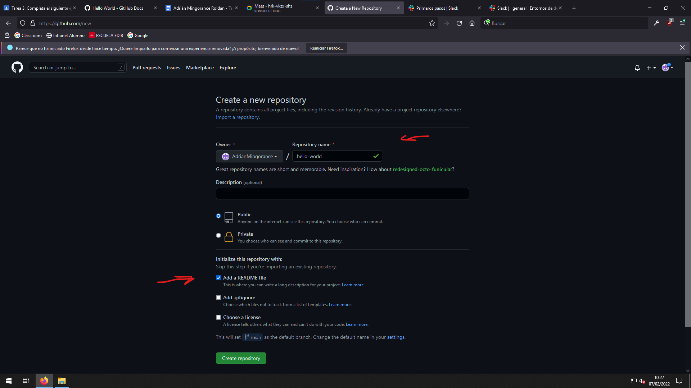
Creamos una rama.
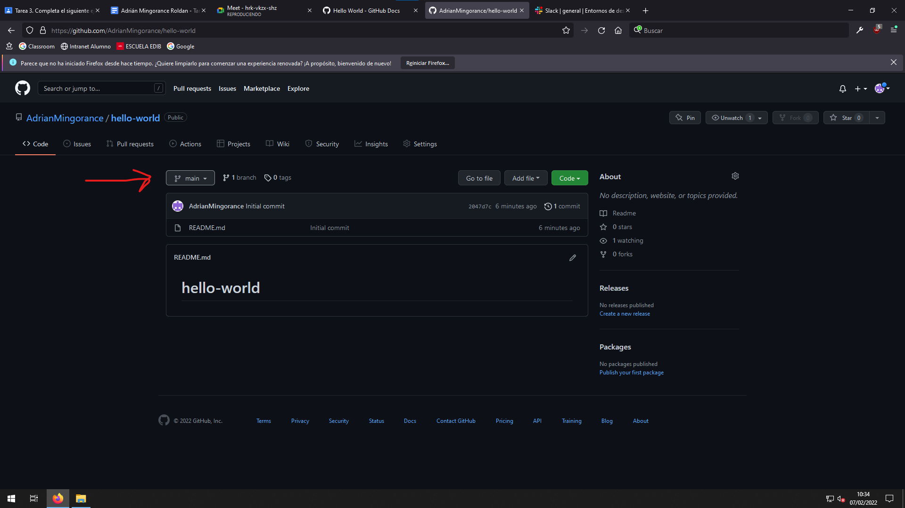
La llamamos “readme-edits”.
Una vez creado quedará así.
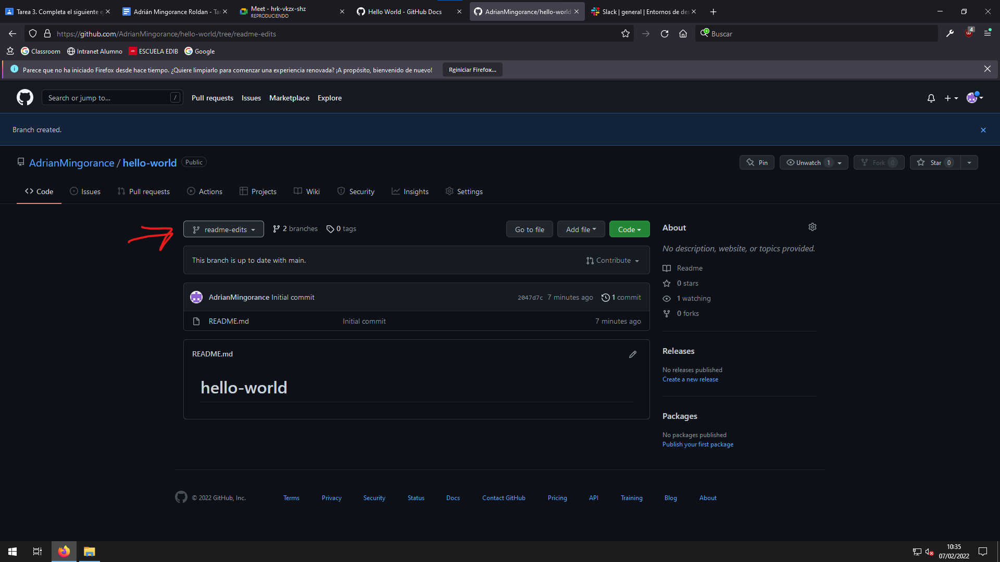
Ahora haremos cambios en el commit.
Clicamos en el archivo readme. Para editarlo hay que clicar en el lápiz.
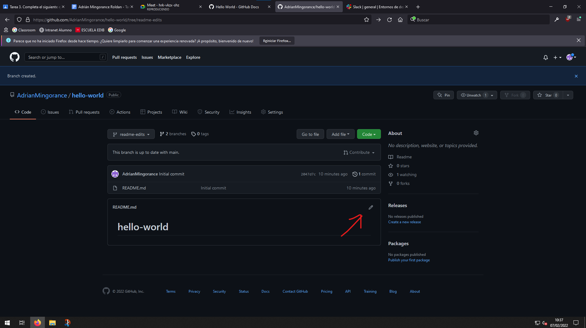
Escribimos cualquier cosa dentro del readme.
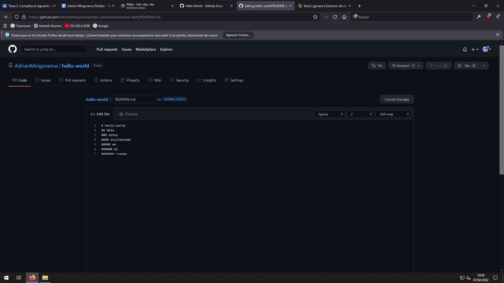
Escribimos un comentario y lo guardamos
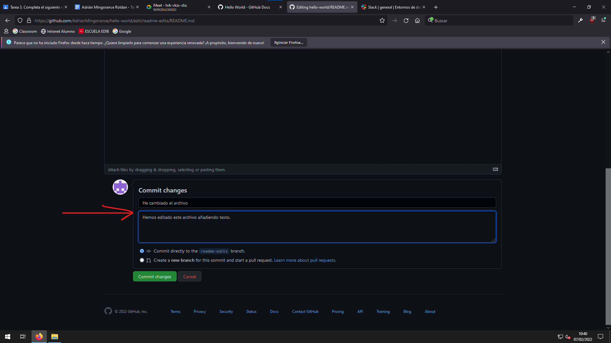
Abrimos el pull request del repositorio.
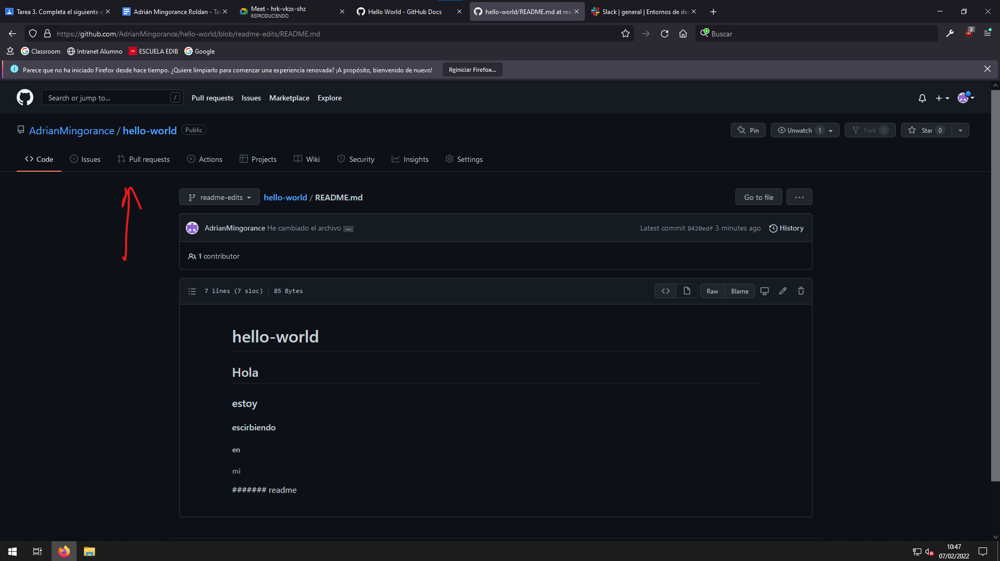
Creamos un nuevo pull request.
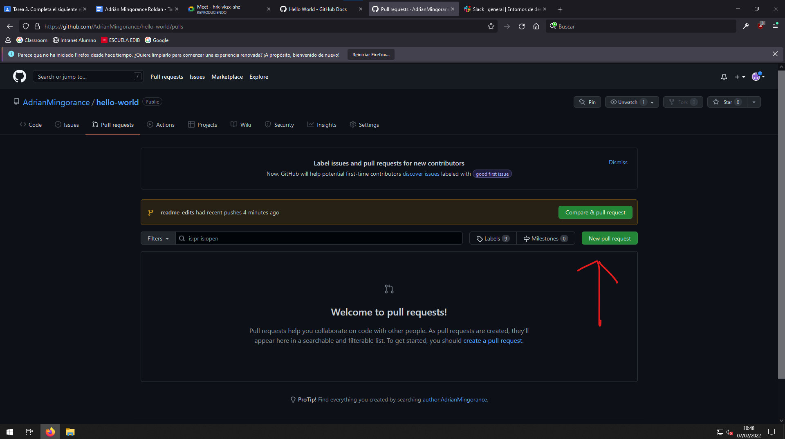
Comparamos una rama con la otra.
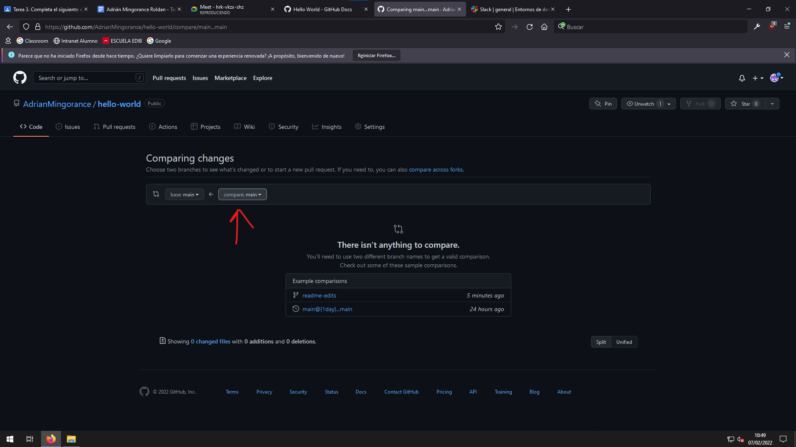
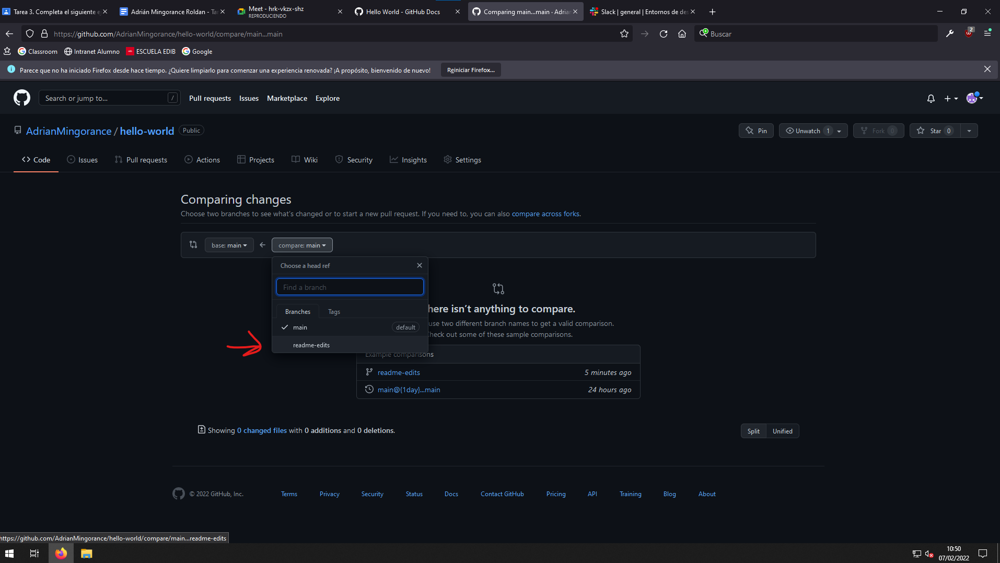
Finalizamos el proceso del pull request.
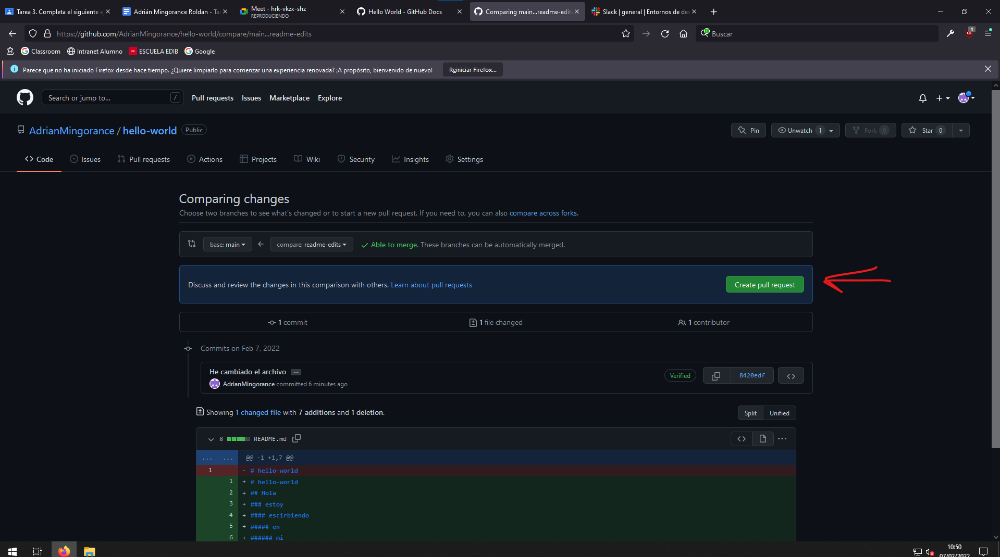
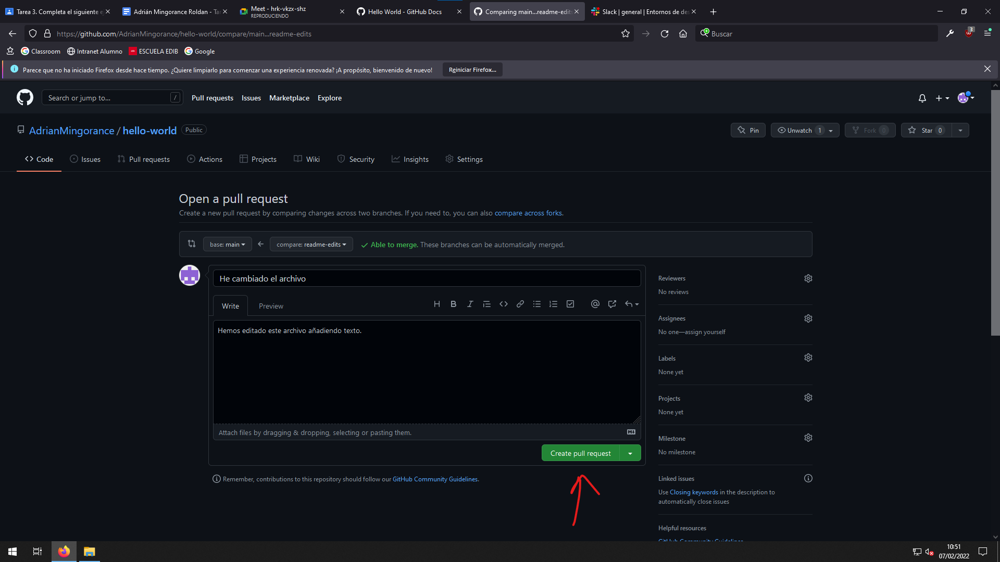
Ahora fusionamos el pull request.
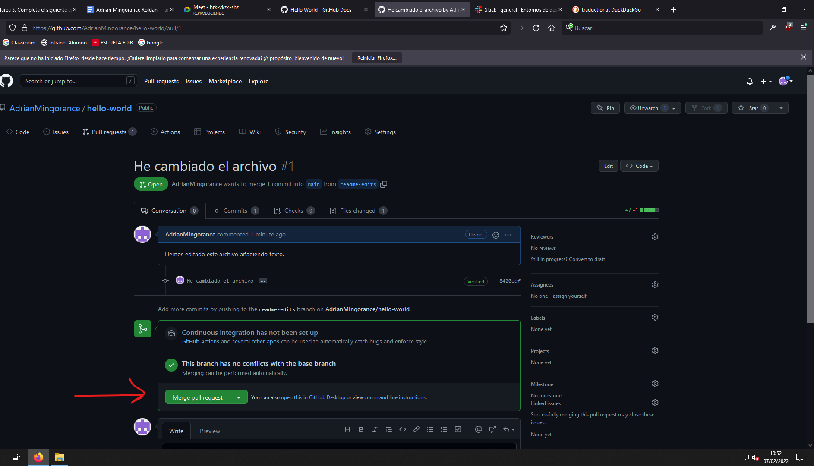
Confirmamos.
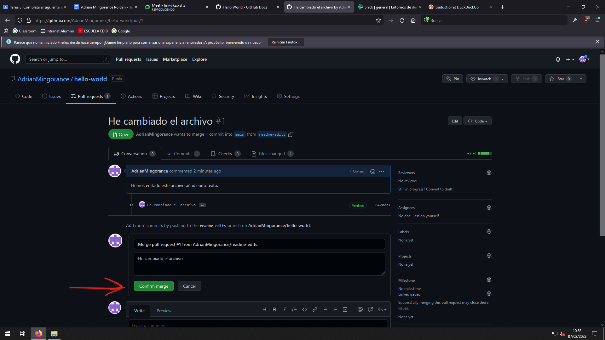
Quedará así.
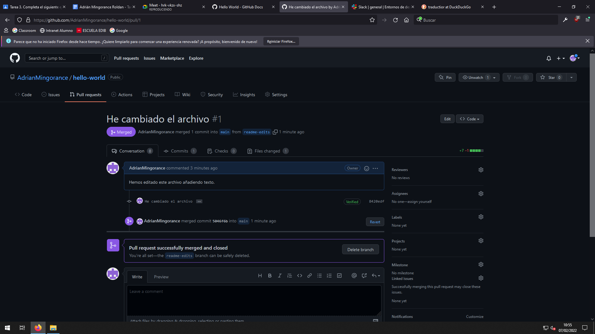
Nos dirigimos a “Code”.
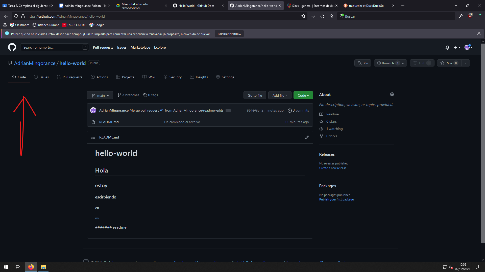
Luego a “Branches”.
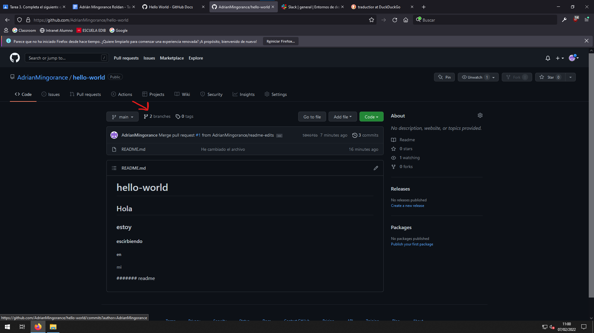
Eliminamos la rama “readme-edits”.
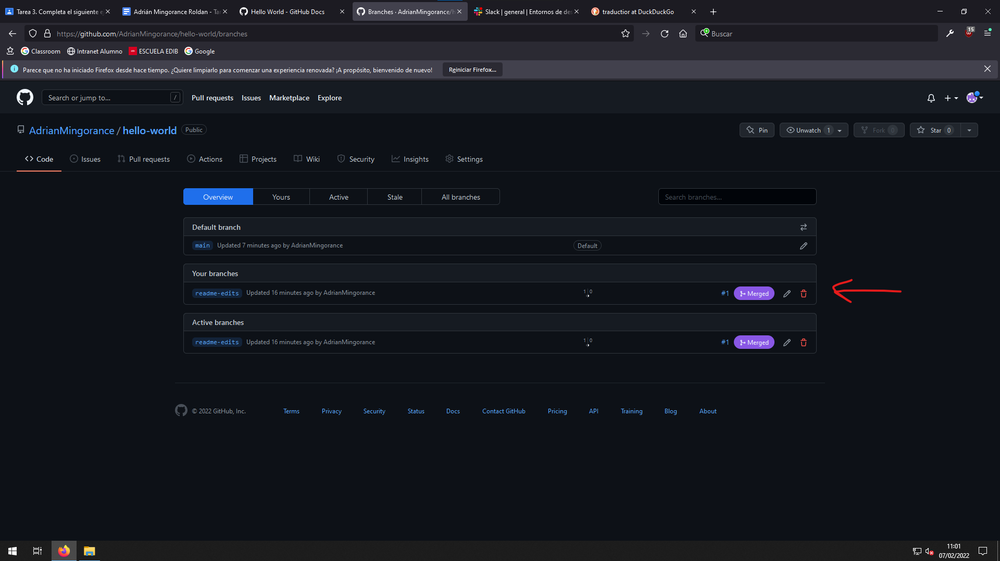

Estos son todos los pasos para hacer este ejercicio
